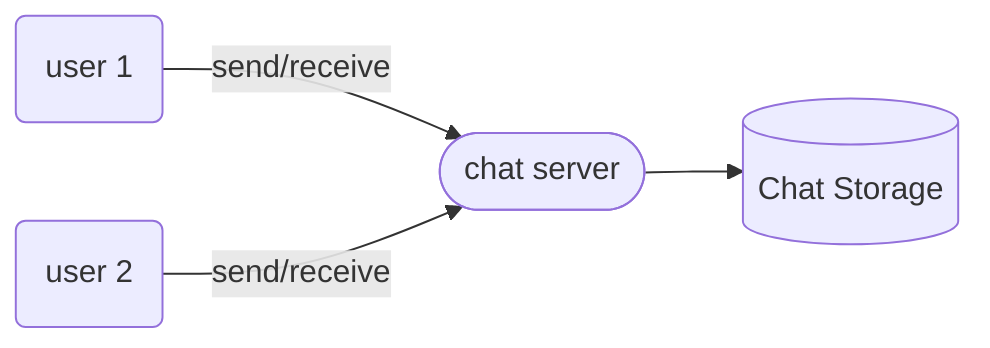

### Collecting Requirements

* Messages to be sent and received.
* Messages to be persistent remotely.
* Online and offline status.
*  Sync between different devices

### Asking right questions

* Offline messages?
* Group chat?
* delete message?
* read and received updates?
* DAU?

### Capacity Estimation 

* 500M DAU
* with around 50 messages per user daily we will get 25B messages per day.
* Storage: 25B * 100Bytes = 2.5 TB/day
* 2.5 TB/86400 sec == 30MB/s incoming and outgoing both

### High Level Design

* So we will have a server through which we will be connecting to send and receive messages.
* and that chat server will have a database too.

So the flow would be like this:
*  Users1 sends a message to user2 via chatserver
* chatserver receives the message, persist it into chat storage and then sends it to user2.
* chat server sends ack to user1 that messages has been sent to user2.

### Deep dive

#### a. Message server

* Now communicating to message can either be done in push or pull based method.
* here push based mechanism would be better.
* Message server will hold all the users which are connected and will pass on the message accordingly.
* So whenever users comes online it will establish an web socket connection with message server. 

* Number of servers will be: assuming modern server can handle 50k connections then 10k of such servers will be needed.
* Also these servers will talk to a centralised server that will have which user is connected to which server.

* Message servers will also handles storing the messages to a database too. and will also talk to this database for any pending messages to be sent.
* Messaging sequence number will also be implemented so that timing difference does not affect the message sequence.

#### b. Database

* Message servers will store all message related info to database as well asynchronously. 
* Database should perform well for large number of small updates and range queries. We can use a wide column key value store like Hbase or cassandra.
* Also paginated views should be passed to users for efficiency.

#### c. Managing user's status

* Keeping track of online users are kinda simple. But what if a user comes online and it will lead to updating all its friends who are online. This push based strategy can result in overload. So instead we will use pulling for updating user status.
*  Or whenever a user tries to send message to an offline user, we will notify them that the users has gone offline.

![[design_facebook.png]]

### Data Partitioning

* We would be sharding our data based on hash of userid. 