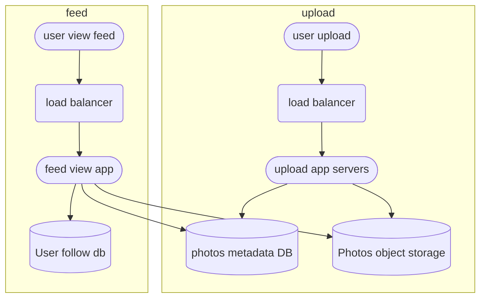
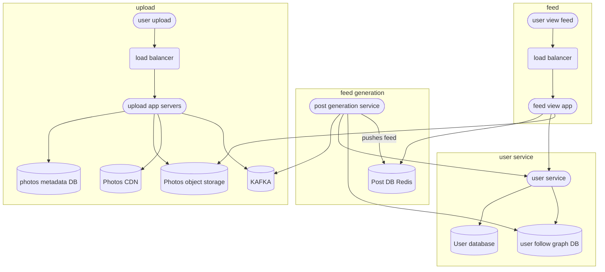

### Gathering Requirements

* User can post and view photos.
* User can follow other users.
* Users will see post from their followings.
* Users can search photos, people.

### Asking right questions

* Can users post multiple photos within a post?
* Like and comment functionality?
* Notification, live feed?
* DAU?

### Scale Estimation

Lets assume 1M DAU.
and 2M photos every day, average photo size 1MB
Storage for 1day = 2TB.

### Database schema

* We will have following tables:
	* Photos
	* Users
	* UserFollow
	* Comments
	* Like
* Now storing them because we would need relations we can use SQL, but with such scale it would be hard to maintain and scale up.
* So we would use key value store like cassandra.
* Photos can be stored into an object storage.
*  User data table fields could have :
	* UserID(32)
	* Name(32)
	* Email(32)
	* DateOfBirth(4)
	* createDate(4)
	* lastLogin(4)
* In total 110 Bytes, 500M * 110 ~=50GB 
* Similarly Photos table can have 500Bytes of data so 2M * 500Bytes = 1GB per day
* then similary comments and like can also take 200MB data each per day.

### High Level Design

### Enhancing Design

* Now this design is fine and all when we don't care about scaling it. For example one the limitation to that could be generating feed in realtime.
* Generating feed would require querying multiple databases tables, applying joins and sorting. and doing it again and again for keeping the feed updated. Too much work and it definitely can't scale well.
* Then when we add into comments and likes things get messier pretty quick. Then we are also not gathering any analytical info here and that could be useful later on.

### Generating Feeds

similar [[Design Twitter]]

* Well instead of generating feed realtime we can pre generate it for users and put it into a sperate table and query that table whenever needed.
* Also this table can be updated whenever we get a new post that should be displayed.
* The client can fetch feeds via push or pull mechanism both. 
#### Handling feed updates from celebs

* This looks fine but hold on what if a popular user post a photo? this action would result in appending to each followers news feed simultaneously and that would again peak our system.
* So what do we do in such cases? well pre generating feeds and updating them real time is good for people who follows people who post rarely. But for celebs feed updating can take previous approach for pull based mechanism. like going to popular celebs latest post and then updating it to users feed.
* In this way pull mechanism used for celebs post and push for others. Kinda of a hybrid approach.

### Final Design

### Keeping the posts sorted according to timestamp

* Now whenever a user access the application, they will first see the most recent post from their followings so naturally we would like them stored into a sorted order.
* Partioning based on hash of post id would make most sense because it will make our sharding balanced as compared to sharding based on user id.
* Then we can also make post id like this:
	* (Epoch time stamp):(auto incrementing counter)
* In this way we made our post id sorted on timestamp and this can speed up our query.