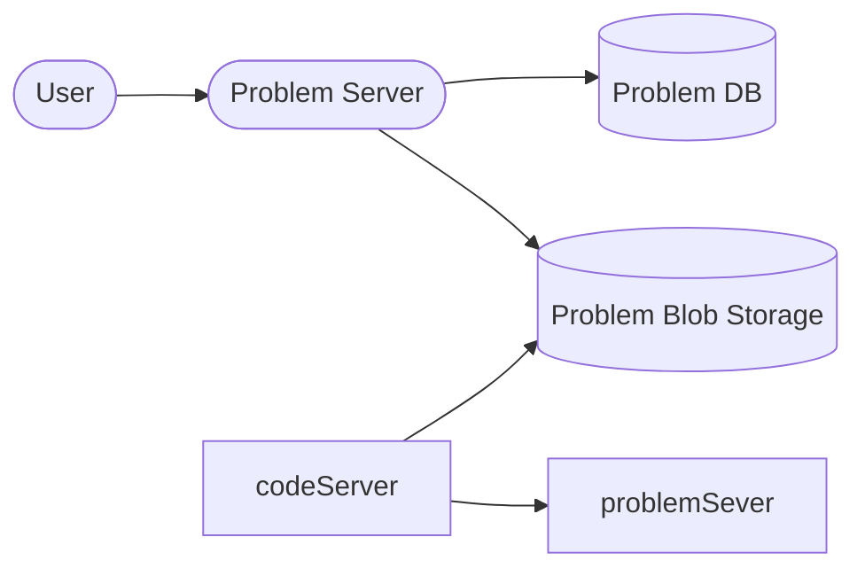

## Requirements

*  Online coding judge.
*  Live leaderboard, Competitions?
* Paid users, priority users ?
* view a list of problems

## Asking right questions 

* Do we have paid users ?
* How many users do we have ?
* Is our system global ?
* Live leaderboard ?
* Plagiarism checks ?

## Non-func requirements 

* Low latency system
* Highly available
* Highly scalable
* Isolated env for code execution

## High Level Design

* So every get problem request and submission request will go through our problem server.
* Problem DB will have list of all the problems and all the metadata info.
* Problem Blob Storage will have all the test cases file and will also hold users code to be ran and tested/
* To keep the user's code execution isolated from the server space, we can use containers as they will be less resource intensive and low start time.
* So we will have a group of worker containers that will connect to the blob storage, get the user's code, test it against the test cases, and produces output.

## Database Schema

* So first thing we will have User table.
* Problem table
* Submission
* Competition

| User   | Problem          | Submission     | Competition   |
| ------ | ---------------- | -------------- | ------------- |
| UserId | ProblemId        | SubmissionId   | CompetitionId |
|        | name             | problemid      | startTime     |
|        | difficulty       | competitionId  | endTime       |
|        | totalSubmissions | userid         | []problemId   |
|        | totalLikes       | testCaseResult |               |
|        | Description      | passes         |               |
|        |                  | error          |               |
|        |                  | metrics        |               |
|        |                  | runtime        |               |

## Deep Dive

### Security
* So our execution env will have certain checks like, timeout per execution.
* Memory limits
* Read only filesystem
* No system calls allowed
* No network resources accesible

![[design leetcode.png]]