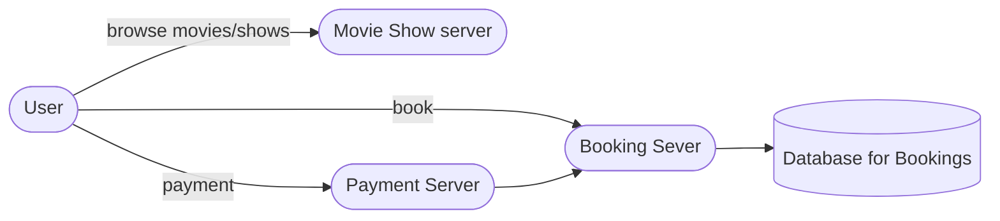

### Gathering Requirements

* List cities where cinemas are located.
* List our all movie released in that city.
* User upon selecting a movie will get shows.
* User will see booked seats/vacant seats.
* cam select multiple seats.
* Can make payment in 5 minture window.

### Asking right question

* DAU?
* how many cities?
* Search ?
* Do we also provide nearby cinemas?
* prebook?
* different kinds of shows?
* how many seats can be booked per transaction?

### High Level Design

*  So users will search through movies and cities through cinema show server.
* All the bookings will go through booking server.
* Booking server will be backed with SQL database to handle transaction.

### Deep dive

* So the flow would be
	* Select show
	* select seats
	* try booking
	* if seats available then book, if not then return to seat selection with error message.
	* reservation confirmed now waiting for payment.
	* if payment goes through then confirm booking, else wait for 5 min then cancel the booking the reverse the seat reservation.

#### a. Getting the unreserved seats

* Now user would like to see the most recent updated seats selection scrreen.
* This will leads on to call the database often to get the unreserved seats, now this too can be put inside a transaction.
* Then upon selecting the seats user will again hit the database to check if seats still remain unreserved then user will be able to proceed to final transaction of reserving those seats.
* Now to scale the reads we can have a master-slave config. 
* Master will have all the writes and reads goes through slaves.
* We will get git on consistency here on the cost of higher availability.

#### b. Booking seats

* User finally reserved the seats, now user will get a 5 minute window to complete the payment.
* This can be handled by payment service.
* If payment times out or gets failed, user reservations will be rolled back.
* But if payment goes through then user will get confirmation of reservation.
* This whole flow will work around our payment service that will sends messages to booking service.
* to make it scalable, we will user multiple servers and Kafka.
* For expiration of window we will use to store in progress booking info.

### Data Partitioning 

* Good sharding will be based on showID. so that we do not have any hot load.