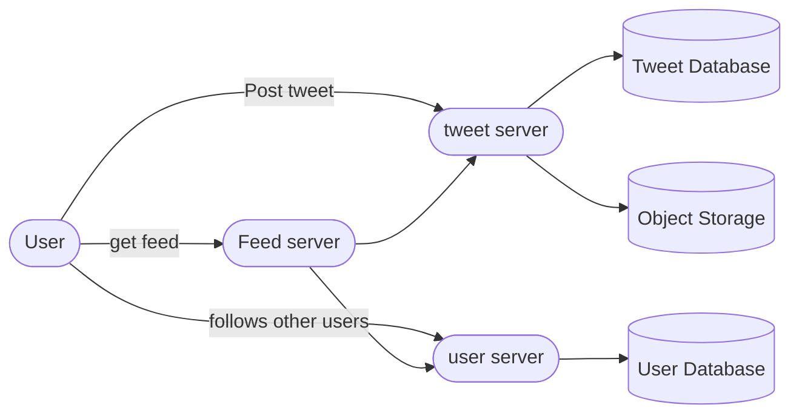

### Collecting Requirements

* Users should be able to post tweets.
* Users follows other users.
* User timeline feature
* Tweet can contain video and photos
* liking tweet.
* replying to tweet/ commenting.

### Asking right questions

* DAU?
* Searching tweets?
* trending hashtags/topics.
* Notifications?
* live updates ?

### Capacity estimation

* 200M DAU, and lets assume each users post 2 tweets average.
* 400M tweets daily.
* each tweet 500 Bytes, 200GB per day

### High Level Design

*  On high level we would have users posting tweets, then users following other users, and then timeline and feed.

### Deep dive

* Now we would deep dive into separate components.

#### a. Posting the tweets
* user posts a tweet with some text,metadata and media too.
* post tweet service will handle that and will store it into a tweet database and for media to object storage.
* now we want to communicate that user has posted a tweet, and corresponding service can take that message and process it anyhow they like.
* So we will publish a message into message queue.

#### b. user follows a user
* User service will handle all operation related to user creation, last logged in, user followers and following and all.
* It will store this info into a sql database. further more graph database can also be used for storing relations between users. so that we can utilize graph like structure of users connections.
* this service will also be used by feed service to generate feed and timelines.

#### c. Feed generation service
* now comes feed generation. feed generation will listen to new post and try to pre generate user feed and store it into a in-memory database for last retrieval.
* this will also use user service to get the connections data.
* user feed actually will take an hybrid approach, like pre generating for normal users and pulling posts from hot/celeb users periodically.
* this can further be optimized for users who have last logged in less than a week ago. 

#### d. Timeline service
* It will communicate with tweet service to get tweets for a particular user.
#### e. Like and comment service
* this service will take a post and add comments and likes into that post and will store this in seperate database.

#### f. Analytics 
* each service will generate messages for each action user performs like liking, commenting, following and posting.
* this messages will be consumed by our streaming analytics service to produce analytics real time.

![[design_twitter_feed.png]]