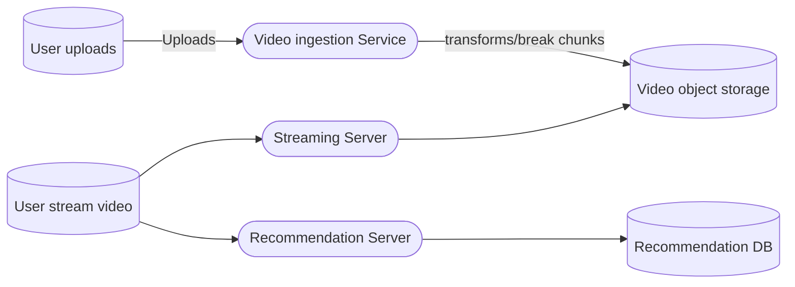

### Gathering Requirements

* Users can upload videos.
* Viewers can search, play videos.
* Can support multiple devices and formats. 
* will support multiple resolutions.
* Viewers will have recommendations on their home page.

### Non functional Req
* We want low latency and high availability system.

### Questions

* Videos like and comment??
* Notifications on video upload?
* Views count??
* subtitles generation?
* video filtering?
* dynamic video resolution?

### High Level Design

* So our users will post their video on the platform.
* platform will take that video and convert it to multiple format and save it to a object storage.
* Users will request a video, and server will send users video chunks.
* user will also have a recommendation page too.

### Deep Dive

#### a. User video upload
* Our video upload service will be responsible for uploading or getting the video to out system.
* This can be through an upload or through external system too.
* Upon uploading it will store the video in an object storage.

#### b. Video processor chunking and encoding
* Now this stage is one the most important stage of the whole system.
* upon receiving video from user we need to run some processes onto that, this could be:
	* Chunking of video
	* Content filter 
	* Content tagging/ subtitle generation
	* Different encoding 
	* Different resolution
* Now upon completion these chunks will be stored into object storage and related metadata info will be store into different database (Cassandra).
* Also will notify users.

#### c. Video tagging and more
* Now the video could have different tags generated and subtitles.
* We can run a ML job into that data and output a desirable information.
* Maybe content classification could be helpful for content based filtering recommendation.

#### d. User Streaming service
* Now to actually stream the video we need info about the encoding format the user device support.
* After that user request will go to video server to ask for where the encoded video resides and then user can pull the required resolution video chunks from there.
* Now we can also store the stream stats and can be useful for analytics.

#### e. Home page service
* Now user will have recommendation within the home page.
* this homepage service will also talk to user service to get data about user.
* Search result are also filtered based on user info.
* then user activity will also get tracked. 
* This data will be used to improve the recommendation engine.

#### f. CDN
* All the video chunks will be stored in CDN.
* Local CDN will also be beneficial.

#### g. Analytics and ML
* Now each user interactions and video classifications will be consumed by spark streaming servjice through Kafka.
* These can be fed to ML models for better recommendation, better thumbail choice and lot more.

![[Design_video_streaming.png]]