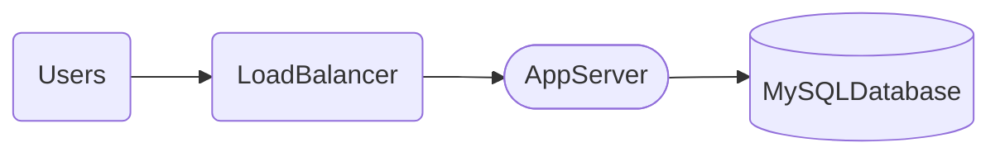
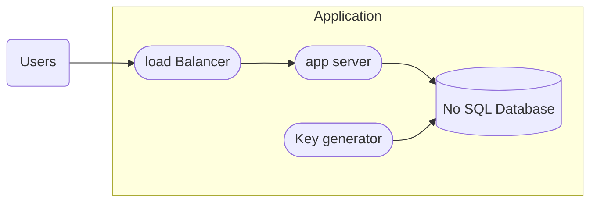

### Collecting Requirements

* We need a service for URL shortening service like tinyURL.
* Users should be able to put an URL and get a shortened url that upon clicking will link them to the orginal URL.
*  Shortened URL will be linked to a user so, same URL can be shortened by multiple users.
* Expiry time?

### Asking right questions

* What would be the length of the output link. 
* Any specific character set we only can use.
* DAU ?
* Can user pick custom URL?

### Scale Estimation

suppose we have 50M daily new url coming in. And assuming that this system would be a ready heavy system, So we can take 1:100 write to read ratio.

100 * 50M = 5B daily reads.

50M/(24 * 3600) =  600 URLs/s

and for read comes to 60K/s reads.

Now, lets find out what would be the size of our unique generated url.
with a characterset of 64 characters. with length of 8 we can get 281 trillion possible string.

that is well above our need so 8 length encoding would be fine.

now let's assume in total 500 bytes is the average length of our stored entry. 
So write volume per day: 500 * 50 M = 25000MB = 25 GB

storage for 5 years = 45 TB

per second bandwidth = 600 * 500 bytes = 300 KB/s writes
and reads 30 MB/s

now taking into consideration of caching then we would need to cache 20% of req then

25 GB * 100/5= 500 GB.

### Communication Interface

* APIs can be designed to take 
	1. API key
	2. URL to be shortened
	3. user name
	4. expiry
	5. custom_alias
 
* So API key is there to throttle the user request and prevent DDOS attacks.

### High Level Design

*  So users will make request to app server via loadbalancer.
* Appserver will take that request and will generate a unique hash and encode it to a 8 length string and will check whether this unique urls has been taken or not. 
* If yes then re generate hash with a salt, if no then put it in database and send the url to user.

### Database Schema

* For storing URLs detail and User detail we can have two tables.
* Database choice can be NoSQL key-value store like DynamoDB and cassandra.
* As Scale will be larger and we don't need relational schema in this case, we can opt for NoSQL.

### Enhancing the design

* As the scale increases we would get into trouble because we are converting high dimensional hash to lower dimensional encoding of length 8, we would face higher collisions. 
* And checking these collisions in runtime is kinda time consuming and will increase the load.
* Also app server is horizontally scalable, these will lead to bottleneck at our database and database would need to handle concurrent transactions.
* Overall this solution is not scalable to most and we would need to find out another approach.

#### Generating keys offline
* Now generating unique string offline and just assigning one to users request is kinda simple and more efficient. we can have another service continously generating unique keys and putting it into database into a table ready_table and app server can fetch one entry from there put it into in_use table and delete original entry from ready_table.
* This way we are bypassing the generating hash and checking for collision thing
* But we still have a problem here, because our system's scale is so large we cannot have a break point/ bottleneck like key generation service.
* And to mitigate that we can have multiple key generation service and will allocate key ranges to each service so that collision doesn't occur.

### Data Partitioning

* Now data can be partitioned using the the first letter or two of the generated string. But these can lead to hot key problem.
* Another approach could be using hash based partitioning instead.
