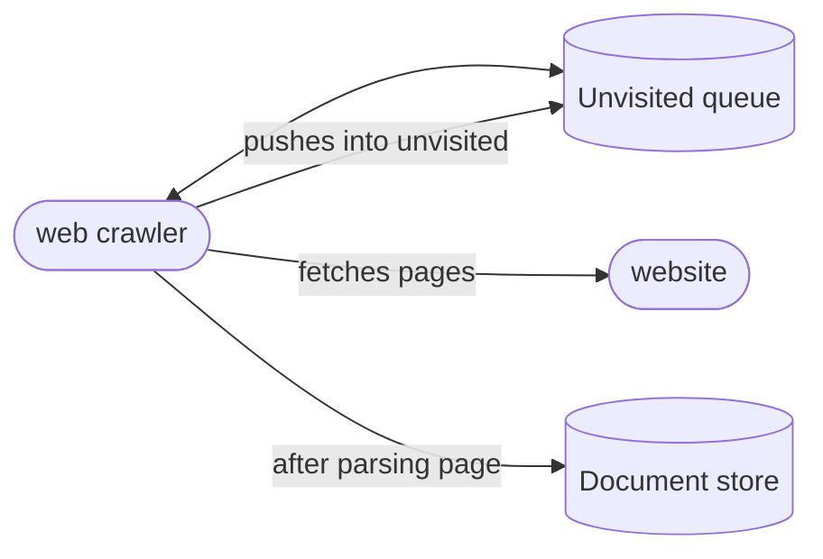

### Gathering requirements

* Browses pages starting from a set of seed urls.
* We need to store the page pages into a database for indexing.
* Recursive crawling to child pages.

### Asking right questions

* So what would be the scale of such crawling.
* do we need to convert the pages into different format?
* any filters we should be putting in crawling.
* only pages or any media?
* only HTTP protocols?
* Follow RobotExclusion?

### Capacity estimations

* lets assume total 15B pages to be crawled within a week.
* will lead to around 6.2K pages per second.
* assume each page is of 100KB on average then total data stored will be 1.5 PB.

### High level design

* our web crawler will pick a url from unvisited list.
* figure out the hostname and IP. connect to that IP.
* fetch page from that, parse it and store the data into a database.
* parsed url from that page will be pushes to unvisited queue after applying an filter whether that url has already been processed or not.

### Deep dive

#### How to crawl

1. **BFS**: it is good but we would have to create and drop connection too often to same website. and this will be an overhead.
2. **DFS**: Now we have established a connection, then we can simply depth search into that website while we still hold onto the connection.
3. **Path-ascending crawling**: Path-ascending crawling can help discover a lot of isolated resources or resources for which no inbound link would have been found in regular crawling of a particular Web site. In this scheme, a crawler would ascend to every path in each URL that it intends to crawl. For example, when given a seed URL of http://foo.com/a/b/page.html, it will attempt to crawl /a/b/, /a/, and /.

#### a. URL frontier:
* It is the data structure that will hold the unvisited URls to be picked for crawling.
* this can have some priority logic for priority loading.
* different servers will connect to this queue and get the URL to be processed.
* Each server will have multiple thread doing the heavy lifting of crawling work.
* How big will our URL frontier be? The size would be in the hundreds of millions of URLs. Hence, we need to store our URLs on a disk. 
* We can implement our queues in such a way that they have separate buffers for enqueuing and dequeuing. 
* Enqueue buffer, once filled, will be dumped to the disk, whereas dequeue buffer will keep a cache of URLs that need to be visited; it can periodically read from disk to fill the buffer.

#### b. Keeping politeness
* Well we don't want our crawler to be rate limited/throttled by the website and nor do we want to bring down the website.
* So we do not want too many connections with a single website.
* and we also do not want to stress the servers out by pulling pages rapidly.

so what will be the solution to that?

* So to achieve this we have to make server allows only one thread to be connected to the host server at a time and will delay its pulling to some extent.
* we can implement a subqueue mechanism within server for each thread. Now a URL's hostname will be hashed to a particular thread number so that only that thread gets to connect to that host server.
* then whenever we want to add a new URL we would push it to thread's subqueue in a FIFO manner. in this way we can have some delay for pulling pages from same hostname.

#### c. fetcher 
* This will handle establishing the connection to hostserver, maintaining robot exclusion rules and will fetch the pages.

#### d. Document input stream
* after fetching the document we would like to store it somewhere to be processed by further stages of our crawler.
#### e. Document dedupe
* Now before storing doc into database we would like to check if we have already got this doc before.
* So to accomplish that we have another layer of worker threads working on dedupe logic.
* We generate a checksum hash of doc, store it in a database. then check through the whole database whether the same hash been there or not.
* Only after URL pass the dedupe test we will store it into the database.

#### f. Extractor
* Extracting URL from the docs. 

#### g. URL filters
* Logic for Filtering of the URLs.

#### h. URL dedupe:
* same as doc dedupe, test out if URL has been seen before or not.

![[web_crawler.png]]

