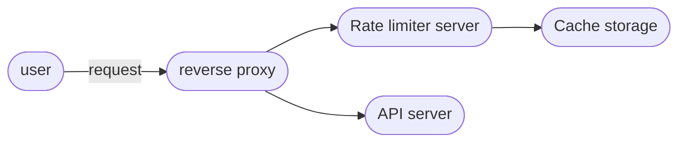

### Gathering Requirements

* Limit the number of request within a time window.
* Its is applicable across the cluster

### Asking right questions

* So is this a hard limit or some range is there.
* How do we notify users of throttling?
* blocking of users?
* Distributed across different locations?

### Different types of throttling

1. Hard throttling: number of api calls can't exceed the limit.
2. Soft throttling: here we provide an extra range based on a fixed range. for example rate-limit of 100 with 10% exceed limit will have max 110 calls per window.
3. Elastic or Dynamic throttling: So here the limit is changes as per some factors like server capacity, timings or any other such factors.

### Algorithms for Rate limiting

#### Fixed window algo:
* we have a fixed time window lets say of 1 minute. and after exactly 1 minute we would reset the counter.
* But in this we have a problem. take a scenario for 1 minute window we can have max 10 calls. users send 10 calls from 30-60 sec. then in the next window sends another 10 calls. so when you actually see within a time period of 60 sec, we got 20 calls, that certainly exceeds our max cap.

#### Rolling window algo:
* This will solve that problem from having an continuous moving window.
* but this will require updating the counter too frequently.

### High Level Design

So our users will go through a reverse proxy which will talk to a rate limiter service to decide whether to pass that call or reject it.

### Deep dive

#### a. Fixed window implementation
* we will have a hash table, which will record the unique users IP. 
* the last timestamp from which the count is taken. and value be the count.
* whenever a new user comes record the timestamp and count=1 in the hashmap.
* a request comes, first check if it exceeds the window size. then reset the counter to 1. if not check if it exceeds the max cap.

If the ‘UserID’ is not present in the hash-table, insert it, set the ‘Count’ to 1, set ‘StartTime’ to the current time (normalized to a minute), and allow the request.
2. Otherwise, find the record of the ‘UserID’ and if CurrentTime – StartTime >= 1 min, set the ‘StartTime’ to the current time, ‘Count’ to 1, and allow the request.
3. If CurrentTime - StartTime <= 1 min and
- If ‘Count < 3’, increment the Count and allow the request.
- If ‘Count >= 3’, reject the request.

#### b. Rolling window implementation
Let’s assume our rate limiter is allowing three requests per minute per user, so, whenever a new request comes in, the Rate Limiter will perform following steps:
1. Remove all the timestamps from the Sorted Set that are older than “CurrentTime - 1 minute”.
2. Count the total number of elements in the sorted set. Reject the request if this count is greater than our throttling limit of “3”.
3. Insert the current time in the sorted set and accept the request.
If we need to track one million users at any time, total memory we would need would be 12GB:
12KB * 1 million ~= 12GB
Sliding Window Algorithm takes a lot of memory compared to the Fixed Window; this would be a scalability issue. What if we can combine the above two algorithms to optimize our memory usage?

#### c. Sliding window with counter
* Now we would like to break in the middle from such two implementation.
* can we divide our time window to smaller fixed time window. lets say 1 hour to be divided into smaller fixed time window of 1 minute and store the counter for the small window.
* we can calculate the sum of all counters in the past hour when we receive a new request to calculate the throttling limit.
* We can store our counters in a Redis Hash since it offers incredibly efficient storage for fewer than 100 keys. When each request increments a counter in the hash, it also sets the hash to expire an hour later. We will normalize each ‘time’ to a minute.
* 8 + (4 + 2 + 20 (Redis hash overhead)) * 60 + 20 (hash-table overhead) = 1.6KB

If we need to track one million users at any time, total memory we would need would be 1.6GB:

1.6KB * 1 million ~= 1.6GB

### Throttling based on IP or user id?

#### IP based
* One can say IP is better because for each call we will get an IP. But what if this IP is a shared one like for a cafe. One bad user can throttle all the other users call.
* and yes one user can have different computers and each can have different IP. This is problematic.

#### Userid based:
* Seems a better option right, but think clearly to authenticate a user to get his userid we would have to let them access our server.
* And that can create a loop hole in our system. user can brute force into authentication system as well.

#### Hybrid:
* A right approach could be to do both per-IP and per-user rate limiting, as they both have weaknesses when implemented alone, though, this will result in more cache entries with more details per entry, hence requiring more memory and storage.
