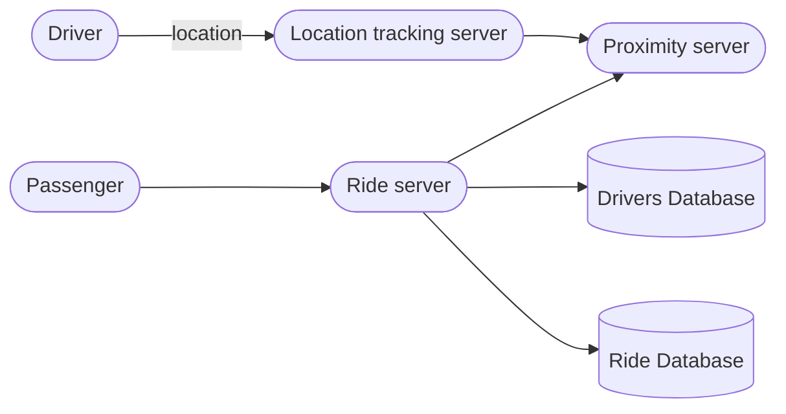

### Gathering requirements

* Drivers will keep on sending their location to the server.
* passenger will send a request to find nearby cab drivers.
* passenger location/driver location can change on the go.
* Passenger can request a ride and all nearby driver will get request.
* the driver/passenger can see each others location will the ride is active.
* location data will be shared with server during ride for other calculations.

### Asking right questions

* Do we track ride locations to gain any insights, dynamic pricing of ride?
* Any premium customers?
* type of cabs supported?
* cab sharing?
* DAU?
* how we will get shortest distance.

### High Level Design

So our drivers will keep on sending their location to the server.
passenger will ask the server to fetch nearest drivers.
passenger will request the ride.
ride will be tracked. and stored.

### Deep dive

* Unlike our [[Designing Yelp or Nearby Apps]] where locations were fixed and changing the tree that quickly wasn't required.
* Drivers will send their location every 3 seconds, and updating the quadtree every 3 seconds is not feasible.
* Then on update we need to update the grid detail of driver, if grids exceed max limit then we need to break it down more. Too much resources will go there.
* And we can't have any delays in location updates of drivers.

#### a. Keeping the grids dynamic
* Now the main overhead for continous update for drivers location is that we will have to change the quad tree to get the neearest drivers. But once we start our ride we can simply pass on drivers location to users device without having to consider that drivers location update.
* Now what if we club all the updates together for all the drivers within lets say 10-15 second time period and update the quadtree at once. 
* We can have a hashmap where key would be drivers id to store the updated location and old location.
* Also same hashmap will help us to pass on the drivers location straight to user.

#### b. Pushing drivers location to user
*  we will have a pub/sub model for this, passengers can subscribe to drivers location update and will get notified.
* Now what if a new drivers comes into the nearby radius, do we push it to users. for this we need to track which area is being tracked by which user. this can increase the complexity. 
* So why not let user pull updated nearby drivers info within some time interval.

#### c. Requesting ride
1. The customer will put a request for a ride.  
2. One of the Aggregator servers will take the request and asks QuadTree servers to return nearby drivers.
3. The Aggregator server collects all the results and sorts them by ratings.
4. The Aggregator server will send a notification to the top (say three) drivers simultaneously,
    whichever driver accepts the request first will be assigned the ride. The other drivers will receive a cancellation request. If none of the three drivers respond, the Aggregator will request a ride from the next three drivers from the list.
5. Once a driver accepts a request, the customer is notified.

#### d. Ride tracking
* Now once ride gets started we need to keep on sending drivers location to passengers devices.
* this continous update will also get tracked and stored into some database for cost calc.

#### e. Ride service
*  This service can be used to keep record of each ride for a passenger and a user.
* Only within the ride driver/passenger can see each others location and communicate through app.
* Ratings will also get stored here. 

![[design_uber.png]]