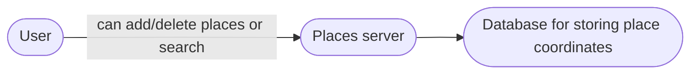

### Gathering requirements

* We have to design an app, where people based on their current location view different nearby locations
* Like a proximity service, can find find places based on a GPS location.
* User can add/edit/delete places. 
* Users can add reviews too.


### Asking right questions

* How nearby the places should be.
* How many type of places do we support.
* How do we sort them ?
* Do we also get a distance metrics?
* DAU?


### Capacity estimation

* Assume 500M places. 

#### High Level Design

So on a high level we will have a server that will handle adding/deleting places.
also a server that handles proximity query.
and a database that will store the places and their coordinates.




### Database Schema

Our places table will have these fields
* LocationID: 8B
* Name: 256B
* Latitude: 8B
* Longitude: 8B
* Description: 512B


### Deep dive

Lets understand the different ways to store and retrieve nearby places.

#### a. SQL solution
*  One simple solution could be to store all the data in a database like MySQL. Each place will be stored in a separate row, uniquely identified by LocationID. Each place will have its longitude and latitude stored separately in two different columns, and to perform a fast search; we should have indexes on both these fields.
To find all the nearby places of a given location (X, Y) within a radius ‘D’, we can query like this:

Select * from Places where Latitude between X-D and X+D and Longitude between Y-D and Y+D

How efficient would this query be? We have estimated 500M places to be stored in our service. Since we have two separate indexes, each index can return a huge list of places and performing an intersection on those two lists won’t be efficient. Another way to look at this problem is that there could be too many locations between ‘X-D’ and ‘X+D’, and similarly between ‘Y-D’ and ‘Y+D’. If we can somehow shorten these lists, it can improve the performance of our query.

#### b. Grid
* We can divide the whole range of latitude and longitude into block of ranges. we can call them grid.
* Based on a given lat and long value, we can identify which grid it belongs too. 
* Then we can simply search out places within/nearby user's grid.
* In the database, we can store the GridID with each location and have an index on it, too, for faster searching. Now, our query will look like:
```sql
Select * from Places where Latitude between X-D and X+D and Longitude between Y-D and Y+D and GridID in (GridID, GridID1, GridID2, ..., GridID8)
```
But this assumes that our grids are uniform distribution of places. well a place like mumbai and rajasthan won't have same distribution to yeah we need something dynamic.

#### c. Dynamic size grids
* lets put a limit of 500 places within a single grid. So whenever we reach our limit we would break down grid into 4 smaller grid.
* What data-structure can hold this information? A tree in which each node has four children can serve our purpose. 
* Each node will represent a grid and will contain information about all the places in that grid. If a node reaches our limit of 500 places, we will break it down to create four child nodes under it and distribute places among them.
* This tree structure in which each node can have four children is called a QuadTree

Building the tree can be handled recursively, start with one node for whole world.

Finding can be seen as traversing the tree until we hit a leaf node. To find neighbouring leaf nodes we can doubly connect them like linked list.

What will be the search workflow? We will first find the node that contains the user’s location. If that node has enough desired places, we can return them to the user. If not, we will keep expanding to the neighboring nodes (either through the parent pointers or doubly linked list) until either we find the required number of places or exhaust our search based on the maximum radius.


### Data partitioning 

* Sharding based on regions:
	* like zipcode. we can identify users zipcode and call the server that corresponds to that zipcode region. 
	* This is cool and all till we have a hot region problem.
* Sharding based on hash of location id:
	* Distributed, but will have to query all the servers to get the results.

### Data replication

* So now one more way to distribute read load is to have multiple read replicas. and one master node. 
* In this way we have kinda got into a sweet spot, we distribute our read load with read replicas as the adding new places freq would be much lower than new search query.

* what if we loose a quad tree server and have to rebuild it? do we again traverse through the whole database and figure out for each location lat and long does it fits into that grid/region.
* Too much work there.
* One solution could be having an reverser mapping of location id to serverid. In this way we can simply query for that serverid which we have lost. and get it rebuilt.
* Kinda of like a reverse index.